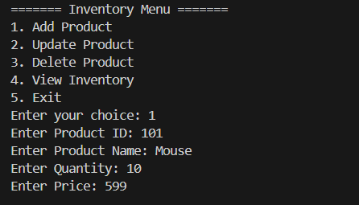
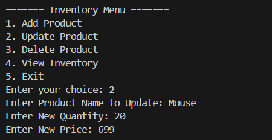
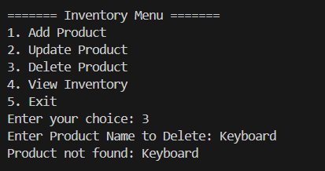
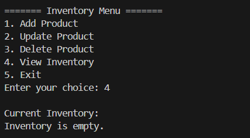

# 🏪 Inventory Management System

This is a simple command-line **Inventory Management System** built in Java. The system supports operations like adding, updating, deleting, and viewing products, all based on the **product name** as a key. Each product is identified by a unique `productId`, but actions are performed using the product name.

---

## 📘 Exercise Question & Answers

### ✅ 1. Understand the Problem

**Q: Why are data structures and algorithms essential in handling large inventories?**  
A: Efficient data structures ensure **quick access, updates, and deletions**. Algorithms improve performance, especially when inventory sizes are large, helping avoid performance bottlenecks in operations.

**Q: What data structures are suitable for this problem?**  
A:  
- **HashMap**: Best for fast retrieval, insertion, and deletion using `productName` as the key.  
- **ArrayList**: Suitable for small datasets, but inefficient for searching.  
- **TreeMap**: Good if sorting is needed.

---

### ✅ 2. Setup

Create a new Java project and include the following three files:
- `Product.java`
- `InventoryManager.java`
- `Main.java`

---

### ✅ 3. Implementation

- A `Product` class stores productId, productName, quantity, and price.
- A `HashMap<String, Product>` is used to manage the inventory by product name.
- Operations include:
  - `addProduct(Product)`
  - `updateProduct(String, int, double)`
  - `deleteProduct(String)`
  - `viewInventory()`

---

### ✅ 4. Analysis

| Operation       | Time Complexity |
|----------------|------------------|
| Add Product     | O(1) average     |
| Update Product  | O(1) average     |
| Delete Product  | O(1) average     |
| View Inventory  | O(n)             |

**Optimization Ideas:**
- Use `TreeMap` if sorted order is required.
- Add bulk/batch operations.
- Migrate to a database for larger scale.

---

## 🧪 Sample Output

### ➕ Adding a Product
```text
Enter Product ID: 101
Enter Product Name: Mouse
Enter Quantity: 50
Enter Price: 499.99
Product added successfully.
```

### ✏️ Updating a Product
```text
Enter Product Name to Update: Mouse
Enter New Quantity: 60
Enter New Price: 450.00
Product updated successfully.
```

### ❌ Deleting a Product
```text
Enter Product Name to Delete: Mouse
Product deleted successfully.
```

### 📦 Viewing Inventory
```text
ID: 103, Name: Monitor, Qty: 10, Price: ₹12000.0
```

---

## 📸 Screenshots (Add your screenshots here)

| Feature         | Screenshot |
|----------------|------------|
| Add Product     |  |
| Update Product  |  |
| Delete Product  |  |
| View Inventory  |  |

---