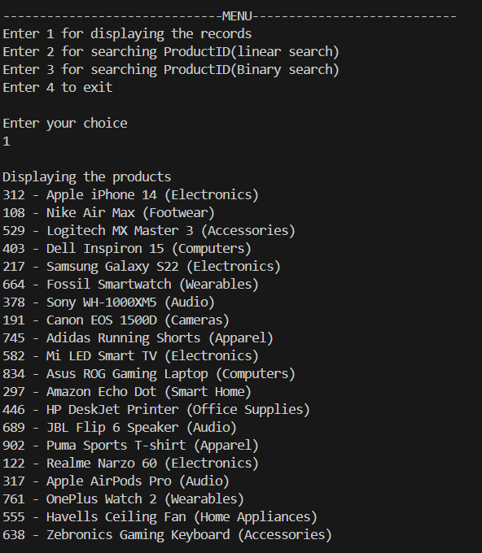
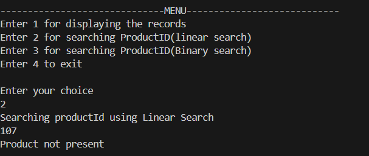
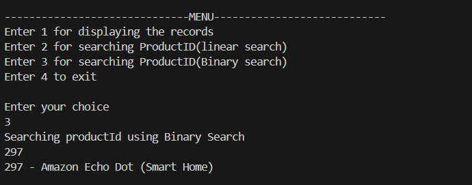

# 📦 Product Search Console Application (Java)

This is a simple **console-based Java application** that simulates an **E-COMMERCE SEARCH FUNCTION**. It allows users to:
- Display product listings
- Search for a product by **Product ID** using **Linear Search**
- Search for a product by **Product ID** using **Binary Search**

---

## 🚀 Features

- **20 Sample Products** from various categories (Electronics, Apparel, Audio, etc.)
- **Linear Search**: Basic traversal to find the target product
    - **Time Complexity : O(n)**
- **Binary Search**: Fast search on a sorted product list
    - **Time Complexity : O(n log n)**
- **Object-Oriented Design**: Uses a `Product` class with encapsulated data and methods

---

## 🧾 How It Works

### Product Class
Defines the structure of a product:
- `productId`: Unique ID of the product
- `productName`: Name/title of the product
- `category`: Category the product belongs to

### Search Methods
- `linearSearch(Product[] list, int target)`: Searches by traversing the entire array.
- `binarySearch(Product[] list, int target)`: Performs binary search on the sorted array of product IDs.

### Console Menu Options
1. Display all products
2. Search a product using Linear Search
3. Search a product using Binary Search
4. Exit the program

---

## 📦 Sample Product

```text
108 - Nike Air Max (Footwear)
122 - Realme Narzo 60 (Electronics)
191 - Canon EOS 1500D (Cameras)
217 - Samsung Galaxy S22 (Electronics)
297 - Amazon Echo Dot (Smart Home)
312 - Apple iPhone 14 (Electronics)
317 - Apple AirPods Pro (Audio)
378 - Sony WH-1000XM5 (Audio)
403 - Dell Inspiron 15 (Computers)
446 - HP DeskJet Printer (Office Supplies)
529 - Logitech MX Master 3 (Accessories)
555 - Havells Ceiling Fan (Home Appliances)
582 - Mi LED Smart TV (Electronics)
638 - Zebronics Gaming Keyboard (Accessories)
664 - Fossil Smartwatch (Wearables)
689 - JBL Flip 6 Speaker (Audio)
745 - Adidas Running Shorts (Apparel)
761 - OnePlus Watch 2 (Wearables)
834 - Asus ROG Gaming Laptop (Computers)
902 - Puma Sports T-shirt (Apparel)
```

---
## Output




---


## 📘 Step 1: Understand Asymptotic Notation

### 🔹 Big O Notation
Big O notation describes the **worst-case scenario** of an algorithm's time or space complexity as input size increases. It helps in comparing and choosing the most efficient algorithm for a given problem.

| Big O      | Description        | Example          |
|------------|--------------------|------------------|
| O(1)       | Constant Time       | Access by index  |
| O(n)       | Linear Time         | Linear Search    |
| O(log n)   | Logarithmic Time    | Binary Search    |
| O(n²)      | Quadratic Time      | Bubble Sort      |

### 🔹 Best, Average, and Worst-Case Scenarios for Search

| Case        | Linear Search      | Binary Search     |
|-------------|--------------------|-------------------|
| Best        | O(1)               | O(1)              |
| Average     | O(n)               | O(log n)          |
| Worst       | O(n)               | O(log n)          |

---


## 📘 Step 4: Analysis

### 🔹 Time Complexity Comparison
Algorithm	Time Complexity	Requires Sorted Array	Space Complexity
Linear Search	O(n)	❌ No	O(1)
Binary Search	O(log n)	✅ Yes	O(1)

### 🔹 Suitability and Use Case
✅ Linear Search:

-Best for small or unsorted datasets.

-Easier to implement and doesn’t require data preparation.

-Suitable when insertions/deletions are frequent.

✅ Binary Search:

-Best for large and sorted datasets.

-Much faster for repeated search operations.

-Requires maintaining a sorted array for accurate results.

---