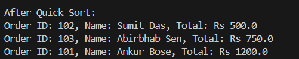

# 📦 Sorting Customer Orders

This Java project demonstrates how to sort customer orders by their total price using **Bubble Sort** and **Quick Sort** algorithms. The goal is to prioritize high-value orders on an e-commerce platform.

---

## ✅ Exercise Breakdown & Answers

### 1. Understand Sorting Algorithms

**🔹 Bubble Sort:**  
- Compares each pair of adjacent elements and swaps them if they are in the wrong order.
- Repeats the process until the array is sorted.
- **Time Complexity:** O(n²) in worst and average cases.

**🔹 Insertion Sort:**  
- Builds the final sorted array one item at a time.
- More efficient than Bubble Sort for small datasets.
- **Time Complexity:** O(n²)

**🔹 Quick Sort:**  
- Uses divide-and-conquer.
- Picks a pivot, partitions the array around the pivot, and recursively sorts partitions.
- **Time Complexity:** O(n log n) average, O(n²) worst-case.

**🔹 Merge Sort:**  
- Recursively divides the array into halves and merges them back in sorted order.
- **Time Complexity:** O(n log n) in all cases.

---

### 2. Setup

Create a class called `Order` with the following attributes:
- `int orderId`
- `String customerName`
- `double totalPrice`

---

### 3. Implementation

Two sorting methods are implemented:
- `bubbleSort(Order[] orders)` — sorts by `totalPrice` in ascending order.
- `quickSort(Order[] orders, int low, int high)` — sorts using Quick Sort logic.

---

### 4. Analysis

| Sorting Algorithm | Time Complexity (Best) | Average | Worst  | Stability | Suitable For         |
|-------------------|------------------------|---------|--------|-----------|-----------------------|
| Bubble Sort       | O(n)                   | O(n²)   | O(n²)  | Stable    | Small datasets only   |
| Quick Sort        | O(n log n)             | O(n log n) | O(n²) | Unstable  | Large datasets        |

**💡 Why Quick Sort is Preferred:**  
- Faster for large datasets due to efficient partitioning.
- Better cache performance.
- Bubble Sort is mainly for educational purposes or very small arrays.

---

## 🔎 Sample Output (Placeholders)

### Before Sorting
```text
Order ID: 101, Name: Ankur Bose, Total: Rs 1200.0
Order ID: 102, Name: Sumit Das, Total: Rs 500.0
Order ID: 103, Name: Abirbhab Sen, Total: Rs 750.0
```

### After Bubble Sort
```text
Order ID: 102, Name: Sumit Das, Total: Rs 500.0
Order ID: 103, Name: Abirbhab Sen, Total: Rs 750.0
Order ID: 101, Name: Ankur Bose, Total: Rs 1200.0
```

### After Quick Sort
```text
Order ID: 102, Name: Sumit Das, Total: Rs 500.0
Order ID: 103, Name: Abirbhab Sen, Total: Rs 750.0
Order ID: 101, Name: Ankur Bose, Total: Rs 1200.0
```

---

## 📸 Screenshot Placeholders

| Feature            | Screenshot |
|--------------------|------------|
| Before Sorting     |  |
| After Bubble Sort  |  |
| After Quick Sort   |  |

---