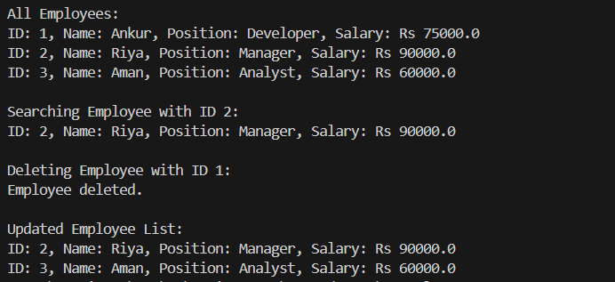

# Employee Management System

## 🚀 Scenario

We are developing an employee management system for a company. Efficiently managing employee records is crucial.

---

## 📌 Exercise 4: Steps and Solutions

### 1. Understand Array Representation

**Explanation:**
- Arrays are stored in contiguous blocks of memory.
- Index-based access allows constant time retrieval.
- Address formula: `address = base_address + index * size_of_element`

**Advantages:**
- Fast access (O(1)) via index.
- Memory-efficient for fixed-size records.
- Easy to implement.

---

### 2. Setup

Create a class `Employee` with attributes:
- `employeeId`
- `name`
- `position`
- `salary`

```java
public class Employee {
    int employeeId;
    String name;
    String position;
    double salary;

    public Employee(int employeeId, String name, String position, double salary) {
        this.employeeId = employeeId;
        this.name = name;
        this.position = position;
        this.salary = salary;
    }

    public void display() {
        System.out.println("ID: " + employeeId + ", Name: " + name + ", Position: " + position + ", Salary: " + salary);
    }
}
```

---

### 3. Implementation

Use an array to store employee records. Create the class `EmployeeManagementSystem`.

```java
public class EmployeeManagementSystem {
    private Employee[] employees;
    private int size;

    public EmployeeManagementSystem(int capacity) {
        employees = new Employee[capacity];
        size = 0;
    }

    public void addEmployee(Employee e) {
        if (size < employees.length) {
            employees[size++] = e;
        } else {
            System.out.println("Employee list is full!");
        }
    }

    public Employee searchEmployee(int employeeId) {
        for (int i = 0; i < size; i++) {
            if (employees[i].employeeId == employeeId) {
                return employees[i];
            }
        }
        return null;
    }

    public void deleteEmployee(int employeeId) {
        for (int i = 0; i < size; i++) {
            if (employees[i].employeeId == employeeId) {
                for (int j = i; j < size - 1; j++) {
                    employees[j] = employees[j + 1];
                }
                employees[--size] = null;
                System.out.println("Employee deleted.");
                return;
            }
        }
        System.out.println("Employee not found.");
    }

    public void displayAll() {
        for (int i = 0; i < size; i++) {
            employees[i].display();
        }
    }
}
```

---

### 4. Separate Main Class

```java
public class Main {
    public static void main(String[] args) {
        EmployeeManagementSystem system = new EmployeeManagementSystem(5);

        system.addEmployee(new Employee(1, "Ankur", "Developer", 75000));
        system.addEmployee(new Employee(2, "Riya", "Manager", 90000));
        system.addEmployee(new Employee(3, "Aman", "Analyst", 60000));

        System.out.println("\nAll Employees:");
        system.displayAll();

        System.out.println("\nSearching Employee with ID 2:");
        Employee found = system.searchEmployee(2);
        if (found != null) found.display();
        else System.out.println("Not found.");

        System.out.println("\nDeleting Employee with ID 1:");
        system.deleteEmployee(1);

        System.out.println("\nUpdated Employee List:");
        system.displayAll();
    }
}
```

---

### 5. Time Complexity Analysis

| Operation      | Time Complexity | Explanation |
|----------------|------------------|-------------|
| Add Employee   | O(1)             | Direct insert at end |
| Search         | O(n)             | Linear search |
| Delete         | O(n)             | Need to shift elements |
| Traverse       | O(n)             | Print all records |

---

### 6. Limitations of Arrays

- **Fixed Size:** Cannot grow dynamically.
- **Shifting Overhead:** Deletion/insertion in middle requires shifting elements.
- **Memory Wastage:** If capacity >> size.
- ✅ Better Alternatives: `ArrayList`, `HashMap` for dynamic and efficient management.

---

### Output


---
