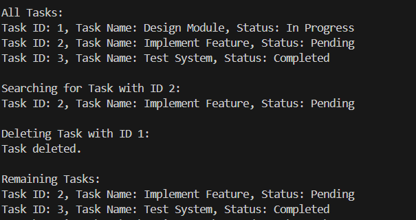

# Task Management System

## 🚀 Scenario

You are developing a task management system where tasks need to be added, deleted, and traversed efficiently.

---

## 📌 Exercise 5: Steps and Solutions

### 1. Understand Linked Lists

**Singly Linked List:**
- Each node has two parts: `data` and `next`.
- Links only in one direction (forward).
- Simple and memory-efficient for one-way traversal.

**Doubly Linked List:**
- Each node has three parts: `data`, `prev`, and `next`.
- Allows bidirectional traversal.
- Slightly more memory usage due to extra pointer.

---

### 2. Setup

Create a class `Task` with:
- `taskId`
- `taskName`
- `status`

```java
public class Task {
    int taskId;
    String taskName;
    String status;

    public Task(int taskId, String taskName, String status) {
        this.taskId = taskId;
        this.taskName = taskName;
        this.status = status;
    }

    public void display() {
        System.out.println("Task ID: " + taskId + ", Task Name: " + taskName + ", Status: " + status);
    }
}
```

---

### 3. Implementation

Create a singly linked list:

#### `TaskNode.java`
```java
public class TaskNode {
    Task task;
    TaskNode next;

    public TaskNode(Task task) {
        this.task = task;
        this.next = null;
    }
}
```

#### `TaskLinkedList.java`
```java
public class TaskLinkedList {
    private TaskNode head;

    public TaskLinkedList() {
        this.head = null;
    }

    public void addTask(Task task) {
        TaskNode newNode = new TaskNode(task);
        if (head == null) {
            head = newNode;
        } else {
            TaskNode current = head;
            while (current.next != null) {
                current = current.next;
            }
            current.next = newNode;
        }
    }

    public Task searchTask(int taskId) {
        TaskNode current = head;
        while (current != null) {
            if (current.task.taskId == taskId) {
                return current.task;
            }
            current = current.next;
        }
        return null;
    }

    public void deleteTask(int taskId) {
        if (head == null) return;

        if (head.task.taskId == taskId) {
            head = head.next;
            System.out.println("Task deleted.");
            return;
        }

        TaskNode current = head;
        while (current.next != null && current.next.task.taskId != taskId) {
            current = current.next;
        }

        if (current.next != null) {
            current.next = current.next.next;
            System.out.println("Task deleted.");
        } else {
            System.out.println("Task not found.");
        }
    }

    public void displayTasks() {
        TaskNode current = head;
        while (current != null) {
            current.task.display();
            current = current.next;
        }
    }
}
```

#### `Main.java`
```java
public class Main {
    public static void main(String[] args) {
        TaskLinkedList taskList = new TaskLinkedList();

        taskList.addTask(new Task(1, "Design Module", "In Progress"));
        taskList.addTask(new Task(2, "Implement Feature", "Pending"));
        taskList.addTask(new Task(3, "Test System", "Completed"));

        System.out.println("\nAll Tasks:");
        taskList.displayTasks();

        System.out.println("\nSearching for Task with ID 2:");
        Task found = taskList.searchTask(2);
        if (found != null) found.display();
        else System.out.println("Task not found.");

        System.out.println("\nDeleting Task with ID 1:");
        taskList.deleteTask(1);

        System.out.println("\nRemaining Tasks:");
        taskList.displayTasks();
    }
}
```

---

### 4. Time Complexity Analysis

| Operation      | Time Complexity | Explanation                    |
|----------------|------------------|--------------------------------|
| Add Task       | O(n)             | Traverse to end to insert      |
| Search Task    | O(n)             | Linear search by ID            |
| Delete Task    | O(n)             | Traverse to locate and unlink  |
| Display Tasks  | O(n)             | Print all tasks sequentially   |

---

### 5. Advantages of Linked Lists over Arrays

- **Dynamic Size:** Grows/shrinks as needed.
- **Efficient Deletion/Insertion:** No need to shift elements.
- **No Predefined Capacity:** Memory allocated on demand.

> However, random access is not possible in O(1), unlike arrays.

---

### 🔧 Output


---
