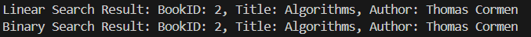

# 📚 Library Management System

## Exercise 6: Library Management System

### ✅ Scenario
We are developing a library management system where users can search for books by title or author.

---

## 🔍 1. Understand Search Algorithms

### Linear Search
- **How it works:** Scans each element of the list one-by-one to find the target.
- **Time Complexity:**  
  - Best Case: O(1)  
  - Average/Worst Case: O(n)
- **Use When:** The list is **unsorted** or **small**.

### Binary Search
- **How it works:** Repeatedly divides a **sorted list** to find the target.
- **Time Complexity:**  
  - Best Case: O(1)  
  - Average/Worst Case: O(log n)
- **Use When:** The list is **sorted**.

---

## 🛠 2. Setup

### Book Class

```java
class Book {
    int bookId;
    String title;
    String author;

    public Book(int bookId, String title, String author) {
        this.bookId = bookId;
        this.title = title;
        this.author = author;
    }

    public String toString() {
        return "BookID: " + bookId + ", Title: " + title + ", Author: " + author;
    }
}
```

---

## ⚙ 3. Implementation

### Linear Search by Title

```java
public static Book linearSearchByTitle(List<Book> books, String targetTitle) {
    for (Book book : books) {
        if (book.title.equalsIgnoreCase(targetTitle)) {
            return book;
        }
    }
    return null;
}
```

### Binary Search by Title (Assuming Sorted List)

```java
public static Book binarySearchByTitle(List<Book> books, String targetTitle) {
    int low = 0;
    int high = books.size() - 1;

    while (low <= high) {
        int mid = (low + high) / 2;
        Book midBook = books.get(mid);

        int compare = midBook.title.compareToIgnoreCase(targetTitle);
        if (compare == 0) {
            return midBook;
        } else if (compare < 0) {
            low = mid + 1;
        } else {
            high = mid - 1;
        }
    }

    return null;
}
```

### Main Method for Testing

```java
public static void main(String[] args) {
    List<Book> books = new ArrayList<>();
    books.add(new Book(1, "Java Programming", "James Gosling"));
    books.add(new Book(2, "Data Structures", "Robert Lafore"));
    books.add(new Book(3, "Algorithms", "Thomas Cormen"));

    // Linear Search
    Book result1 = linearSearchByTitle(books, "Algorithms");
    System.out.println("Linear Search Result: " + (result1 != null ? result1 : "Not Found"));

    // Sort list for Binary Search
    books.sort(Comparator.comparing(book -> book.title.toLowerCase()));

    // Binary Search
    Book result2 = binarySearchByTitle(books, "Algorithms");
    System.out.println("Binary Search Result: " + (result2 != null ? result2 : "Not Found"));
}
```

---

## 📊 4. Analysis

| Feature               | Linear Search      | Binary Search      |
|----------------------|--------------------|--------------------|
| Time Complexity       | O(n)               | O(log n)           |
| Data Requirement      | Unsorted           | Sorted             |
| Use Case              | Small/Unsorted     | Large/Sorted       |
| Implementation        | Simple             | Requires sorting   |

---

## ✅ Conclusion

- Use **Linear Search** for small or unsorted data.
- Use **Binary Search** for large and sorted data for optimized performance.

---

## Output


---
