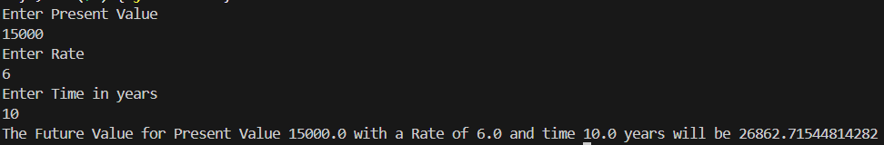

# Financial Forecasting Tool

## 🚀 Overview
This project implements a **Financial Forecasting Tool** using a recursive approach to calculate the future value of an investment based on its present value, growth rate, and time duration in years.

---

## 📘 Exercise Objective

### 🧠 1. Understand Recursive Algorithms:
Recursion is a technique where a function calls itself to solve a problem. It simplifies problems that have a repetitive or hierarchical nature, such as financial forecasting, by breaking them down into smaller subproblems.

In this case, the recursive function computes the future value over time by repeatedly applying the growth rate.

---

### 🛠️ 2. Setup
- Java Class: `index.java`
- Input from the user:
  - Present Value (PV)
  - Annual Growth Rate (r)
  - Time in Years (t)

---

### 💻 3. Implementation

```java
import java.util.Scanner;

public class index {
    public static double futureValue(double presentValue, double rate, double n) {
        if (n == 0) {
            return presentValue;
        }
        return futureValue(presentValue * (1 + rate), rate, n - 1);
    }

    public static void main(String[] args) {
        Scanner sc = new Scanner(System.in);

        System.out.println("Enter Present Value ");
        double PV = sc.nextDouble();

        System.out.println("Enter Rate ");
        double r = sc.nextDouble();
        double rateInPercentage = r / 100;

        System.out.println("Enter Time in years ");
        double t = sc.nextDouble();

        double FV = futureValue(PV, rateInPercentage, t);
        System.out.println("The Future Value for Present Value " + PV + " with a Rate of " + r + " and time " + t
                + " years will be " + FV);
        sc.close();
    }
}
```

---

### 📊 4. Analysis

- **Time Complexity**: O(n), where `n` is the number of years. Each recursive call processes one year.
- **Space Complexity**: O(n) due to the recursive call stack.

### ⚙️ Optimization
To avoid excessive computation in deeper recursions:
- Use **iterative approach** if stack overflow is a concern.
- Use **memoization** for more complex variations where subproblems overlap.

---

## 📎 Example
**Input:**
- Present Value: 1000
- Rate: 5%
- Time: 3 years

**Output:**
```
The Future Value for Present Value 1000.0 with a Rate of 5.0 and time 3.0 years will be 1157.625
```

---
## Screenshot

---
