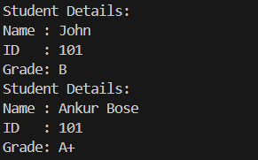

# MVCPatternExample

## Description
A simple Java application demonstrating the MVC (Model-View-Controller) design pattern using a student record management system.

## Structure

- **Model**: `Student.java`
- **View**: `StudentView.java`
- **Controller**: `StudentController.java`
- **Main**: `MVCPatternDemo.java`

## Screenshot Placeholder


## How to Run

1. Compile all `.java` files:
    ```bash
    javac *.java
    ```

2. Run the main class:
    ```bash
    java Main
    ```

## Output
```
Student Details:
Name : John
ID   : 101
Grade: B

Student Details:
Name : Ankur Bose
ID   : 101
Grade: A+
```