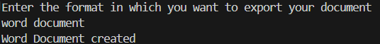
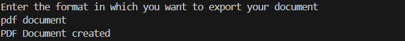
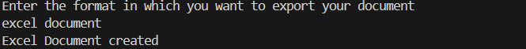

# 📄 Factory Method Pattern Example - Java

This project demonstrates the **Factory Method Design Pattern** using a simple **Document Management System** that can create different types of documents such as **Word**, **PDF**, and **Excel**.

---

## 📚 Design Pattern Used

> **Factory Method Pattern**  
Defines an interface for creating an object, but lets subclasses alter the type of objects that will be created. This promotes **loose coupling** and **scalability** in object creation.

---

## 📁 Project Structure

```
FactoryMethodPatternExample/
├── Document.java
├── WordDocument.java
├── PDFDocument.java
├── ExcelDocument.java
├── DocumentFactory.java
├── WordDocumentFactory.java
├── PDFDocumentFactory.java
├── ExcelDocumentFactory.java
├── FactoryMethodPatternExample.java
├── README.md
└── screenshots/
    ├── word_document_output.png
    ├── pdf_document_output.png
    └── excel_document_output.png
```

---

## 📁 Class Descriptions

### 📌 `Document.java`
```java
public interface Document {
    void document();
}
```

---

### 📌 `WordDocument.java`, `PDFDocument.java`, `ExcelDocument.java`
Each implements the `Document` interface and defines specific behavior.

```java
public class WordDocument implements Document {
    public void document() {
        System.out.println("Word Document created");
    }
}
```

---

### 📌 `DocumentFactory.java`
An abstract factory class that declares the factory method.

```java
public abstract class DocumentFactory {
    abstract Document createDocument();
}
```

---

### 📌 `WordDocumentFactory.java`, `PDFDocumentFactory.java`, `ExcelDocumentFactory.java`
Each concrete factory implements the `createDocument()` method to instantiate a specific document.

```java
public class PDFDocumentFactory extends DocumentFactory {
    public Document createDocument() {
        return new PDFDocument();
    }
}
```

---

## 🚀 Main Driver Class

### 📌 `FactoryMethodPatternExample.java`
```java
import java.util.Scanner;

public class FactoryMethodPatternExample {
    public static void main(String[] args) {
        Scanner sc = new Scanner(System.in);
        System.out.println("Enter the format in which you want to export your document");
        String format = sc.nextLine().trim().toLowerCase();

        DocumentFactory factory;

        switch (format) {
            case "word document":
                factory = new WordDocumentFactory();
                break;
            case "pdf document":
                factory = new PDFDocumentFactory();
                break;
            case "excel document":
                factory = new ExcelDocumentFactory();
                break;
            default:
                System.out.println("Invalid document format.");
                sc.close();
                return;
        }

        Document doc = factory.createDocument();
        doc.document();
        sc.close();
    }
}
```

---

## 🧪 Sample Inputs & Outputs

### ✅ Input 1:
```
word document
```
**Output:**
```
Word Document created
```

---

### ✅ Input 2:
```
pdf document
```
**Output:**
```
PDF Document created
```

---

### ✅ Input 3:
```
excel document
```
**Output:**
```
Excel Document created
```

---

## 📸 Output Screenshots

> Add console output screenshots to the `screenshots/` folder.

### 📝 Word Document Output


---

### 📕 PDF Document Output


---

### 📊 Excel Document Output


---

## 🛠️ How to Run

1. Clone or download the repository.
2. Open the project in any Java IDE (IntelliJ, Eclipse, VS Code, etc.).
3. Compile and run the file: `FactoryMethodPatternExample.java`.
4. Input one of:
   - `word document`
   - `pdf document`
   - `excel document`
5. View the console to verify the correct document creation message.

---

## 🎯 Learning Objectives

- Understand and implement the **Factory Method Pattern** in Java.
- Learn the importance of abstracting object creation.
- Gain practice in writing clean, modular, and extensible code.

---

## ✍️ Created By

**Ankur Bose**
