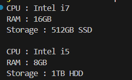

# Builder Pattern Example

This Java project demonstrates the **Builder Pattern** for creating complex objects, specifically a `Computer` class with multiple optional parts.

## 📁 Project Structure

```
BuilderPatternExample/
├── Computer.java
├── BuilderPatternExample.java
└── README.md
```

## 💡 Problem Statement

You are developing a system to create complex objects such as a Computer with multiple optional parts. Use the Builder Pattern to manage the construction process.

## ✅ Implementation Steps

1. **Create a Product Class**
   - A `Computer` class is created with private final fields for `CPU`, `RAM`, and `Storage`.

2. **Implement Builder Class**
   - A static nested class `ComputerBuilder` inside `Computer` is created.
   - It has setter methods for each attribute returning the builder itself (for method chaining).

3. **Build Method**
   - A `build()` method returns a fully constructed `Computer` object using private constructor.

4. **Demonstrate in Main**
   - Two `Computer` objects are created with different configurations.

## 📦 Sample Code

### `Computer.java`
```java
class Computer {

    private final String cpu;
    private final String ram;
    private final String storage;

    private Computer(ComputerBuilder builder) {
        this.cpu = builder.cpu;
        this.ram = builder.ram;
        this.storage = builder.storage;
    }

    public String getCpu() { return cpu; }
    public String getRam() { return ram; }
    public String getStorage() { return storage; }

    @Override
    public String toString() {
        return ("CPU : " + this.cpu + "\nRAM : " + this.ram + "\nStorage : " + this.storage);
    }

    static class ComputerBuilder {
        private String cpu;
        private String ram;
        private String storage;

        public ComputerBuilder() {}

        public static ComputerBuilder builder() {
            return new ComputerBuilder();
        }

        public ComputerBuilder setCpu(String cpu) {
            this.cpu = cpu;
            return this;
        }

        public ComputerBuilder setRam(String ram) {
            this.ram = ram;
            return this;
        }

        public ComputerBuilder setStorage(String storage) {
            this.storage = storage;
            return this;
        }

        public Computer build() {
            return new Computer(this);
        }
    }
}
```

### `BuilderPatternExample.java`
```java
public class BuilderPatternExample {
    public static void main(String[] args) {
        Computer computer1 = Computer.ComputerBuilder.builder()
            .setCpu("Intel i7")
            .setRam("16GB")
            .setStorage("512GB SSD")
            .build();

        Computer computer2 = Computer.ComputerBuilder.builder()
            .setCpu("Intel i5")
            .setRam("8GB")
            .setStorage("1TB HDD")
            .build();

        System.out.println(computer1);
        System.out.println();
        System.out.println(computer2);
    }
}
```

## 🖥️ Sample Output

```
CPU : Intel i7
RAM : 16GB
Storage : 512GB SSD

CPU : Intel i5
RAM : 8GB
Storage : 1TB HDD
```

## 🖼️ Output Screenshot Placeholder

| Output 1 
|----------
|  |


## 🧠 Conclusion

The Builder Pattern provides a flexible solution for constructing complex objects step by step. It improves code readability and maintainability.