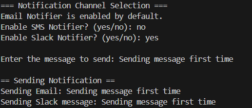

# DecoratorPatternExample

## 💡 Description
This Java project demonstrates the **Decorator Pattern** through a notification system. The base notifier (Email) is always enabled. The user can dynamically choose to add SMS or Slack notifications using console input at runtime.

## 🧱 Structure
- `Notifier.java`: Interface with a `send()` method.
- `EmailNotifier.java`: Base concrete class that sends email.
- `NotifierDecorator.java`: Abstract decorator class.
- `SMSNotifierDecorator.java`: Decorator for sending SMS.
- `SlackNotifierDecorator.java`: Decorator for sending Slack messages.
- `Main.java`: Accepts user input to add desired notification channels.

## ▶️ Sample Output

### Example 1: Email + SMS
```
=== Notification Channel Selection ===
Email Notifier is enabled by default.
Enable SMS Notifier? (yes/no): yes
Enable Slack Notifier? (yes/no): no

Enter the message to send: Hello from user!

== Sending Notification ==
Sending Email: Hello from user!
Sending SMS: Hello from user!
```

### Example 2: Email + Slack
```
Enable SMS Notifier? (yes/no): no
Enable Slack Notifier? (yes/no): yes

Enter the message to send: Urgent update!

== Sending Notification ==
Sending Email: Urgent update!
Sending Slack message: Urgent update!
```

## 🖼 Output Screenshots



## 🛠 How to Run

1. Open the project in any Java IDE (e.g., IntelliJ, Eclipse, VS Code).
2. Compile all `.java` files.
3. Run `Main.java` and follow the prompts in the console.

---

## 📌 Decorator Pattern Benefits

- Adds functionality **without altering original classes**.
- Encourages **Open-Closed Principle**.
- Easily extendable for new channels (e.g., WhatsApp, Telegram, etc.).

