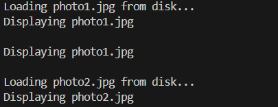

# 🖼️ Proxy Pattern Example - Image Viewer

## 📚 Pattern: Proxy Design Pattern

This project demonstrates the **Proxy Pattern** in Java using an Image Viewer scenario. The proxy object controls access to the real object and adds lazy initialization and caching functionality to optimize performance.

## 📌 Scenario

We are building an image viewer application where images are loaded from a remote server. To avoid unnecessary loading and improve performance, a proxy image object is used that only loads the real image when needed.

## ▶️ How to Run

1. Open your IDE (e.g., VS Code, Eclipse, IntelliJ)
2. Create a Java project named `ProxyPatternExample`
3. Copy the files into the `src/` folder
4. Compile and run `ProxyPatternDemo.java`

## 🖨️ Sample Output

```bash
Loading photo1.jpg from disk...
Displaying photo1.jpg

Displaying photo1.jpg

Loading photo2.jpg from disk...
Displaying photo2.jpg
```

## 🖼️ Output Screenshots



## 🧠 Key Concepts Demonstrated

- **Proxy Pattern**
- **Lazy Initialization**
- **Object Caching**
- **Encapsulation and Delegation**

## 📘 References

- GoF Design Patterns
- Java Design Patterns Book