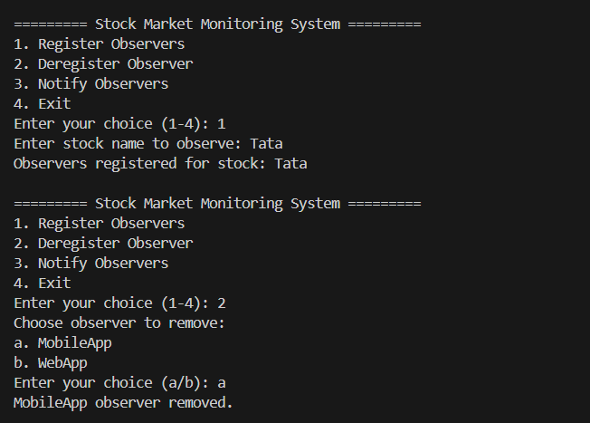

# ObserverPatternExample - Stock Market Monitor

This project demonstrates the **Observer Design Pattern** using a real-world scenario: a stock market monitoring system. In this system, multiple observers (clients like MobileApp and WebApp) subscribe to stock updates. When the stock price changes, all registered observers are notified automatically.

---

## 📌 Features

- Register and deregister observers dynamically
- Notify multiple observers about stock changes
- Console-based user input with a clean interactive menu
- Object-oriented implementation using interfaces and classes

---

## 📁 Project Structure

```
ObserverPatternExample/
├── Main.java             // Entry point with menu-based interaction
├── Stock.java            // Subject interface
├── StockMarket.java      // Concrete subject (implements Stock)
├── Observer.java         // Observer interface
├── MobileApp.java        // Concrete observer
└── WebApp.java           // Concrete observer
```

---

## 🚀 How to Run

1. Clone or download this repository.

2. Compile all `.java` files using a terminal:
   ```bash
   javac *.java
   ```

3. Run the main class:
   ```bash
   java Main
   ```

4. Follow the on-screen menu to interact with the stock monitoring system.

---

## ✅ Sample Menu

```
========= Stock Market Observer System =========
1. Register Observers
2. Deregister Observer
3. Notify Observers
4. Exit
Enter your choice (1-4):
```

---

## 📸 Output Screenshots




---

## 🧠 Design Pattern Used

### Observer Pattern
The **Observer pattern** defines a one-to-many dependency between objects so that when one object changes state, all its dependents are notified and updated automatically.

---