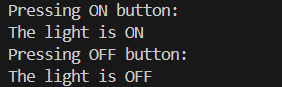

# CommandPatternExample

This project demonstrates the **Command Design Pattern** by simulating a home automation system where a remote control issues ON and OFF commands to a light.

## Project Structure
- `Command.java` – Command interface
- `Light.java` – Receiver class
- `LightOnCommand.java` / `LightOffCommand.java` – Concrete command implementations
- `RemoteControl.java` – Invoker class
- `CommandPatternDemo.java` – Main test class

## How It Works
The remote control holds a reference to a command object and calls `execute()` when a button is pressed. Commands encapsulate requests to the `Light` object.

## Output
