# 📘 Java Testing and Logging Exercises

This repository contains hands-on exercises focusing on three essential areas of Java development:

- ✅ JUnit Testing (Basic & Advanced)
- 🔍 Mockito for Mocking & Verification
- 🪵 SLF4J Logging with Logback

Each section includes a brief description of the objectives and placeholders to attach your output screenshots. Please replace the placeholder image tags with your actual screenshots.

---

## ✅ JUnit Testing

### 1. Basic JUnit Testing

#### Exercise 1: Setting Up JUnit
-  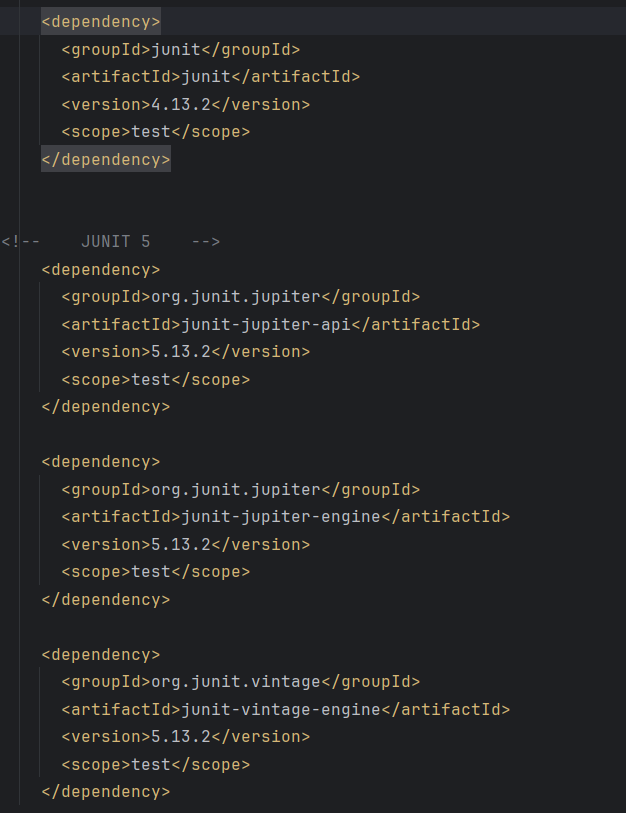

#### Exercise 2: Writing Basic JUnit Tests
- 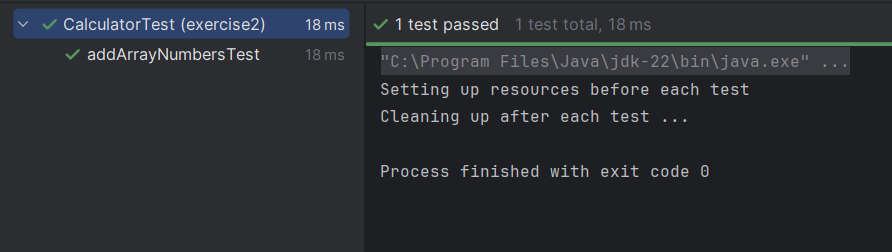

#### Exercise 3: Using Assertions
- Goal: Use various assertions like `assertEquals`, `assertTrue`, etc.
- 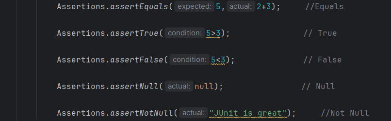

#### Exercise 4: AAA Pattern and Fixtures
- Goal: Apply Arrange-Act-Assert (AAA) and use `@Before` & `@After`.
- 

---

### 2. Advanced JUnit Testing

#### Exercise 1: Parameterized Tests
- 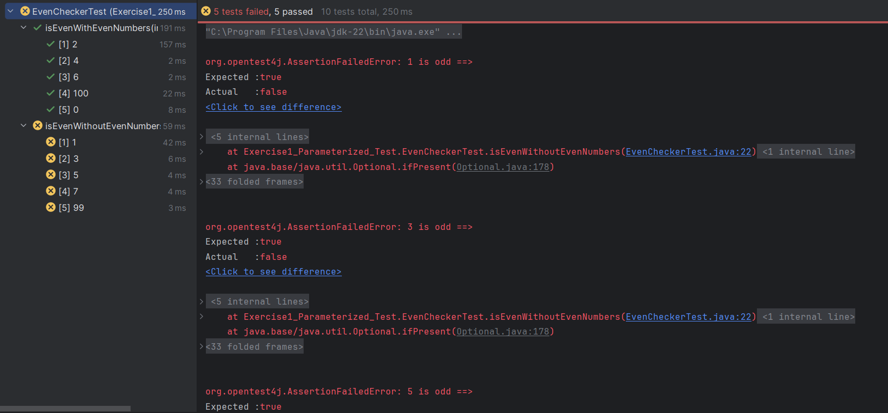

#### Exercise 2: Test Suites and Categories
- Goal: Organize tests using `@Suite`.
- 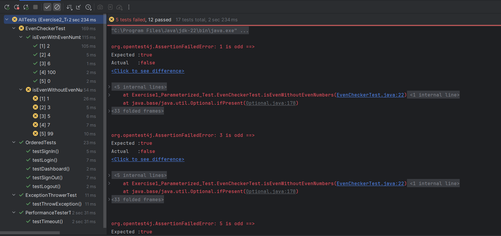

#### Exercise 3: Test Execution Order
- Goal: Use `@TestMethodOrder` and `@Order` annotations.
- 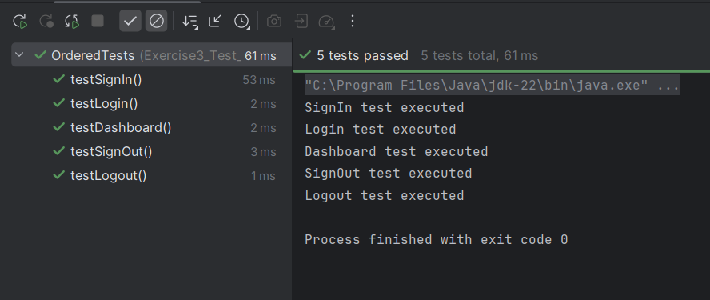

#### Exercise 4: Exception Testing
- Goal: Test if a method throws a specific exception.
- 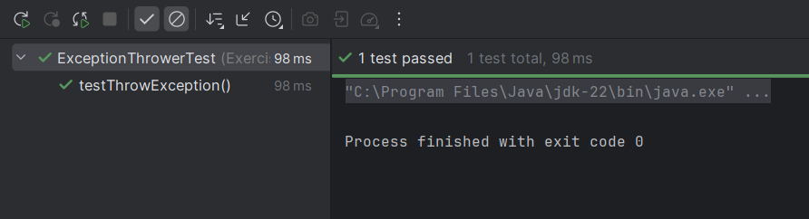

#### Exercise 5: Timeout and Performance
- Goal: Ensure methods run within time limits.
- 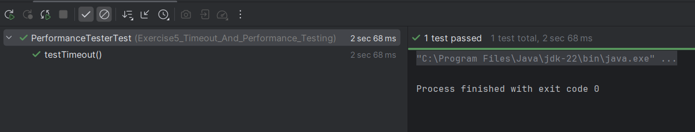

---

## 🔍 Mockito Exercises

### Exercise 1: Mocking and Stubbing
- Goal: Mock external API and stub its behavior.
- 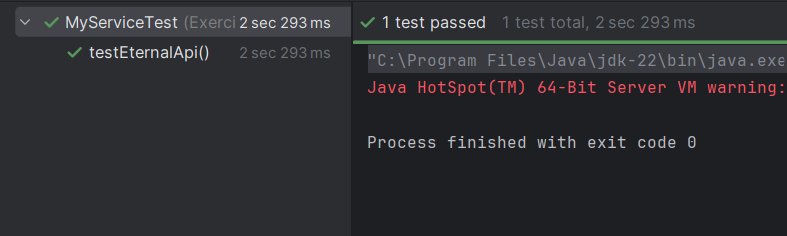

### Exercise 2: Verifying Interactions
- Goal: Verify method call with specific arguments.
- 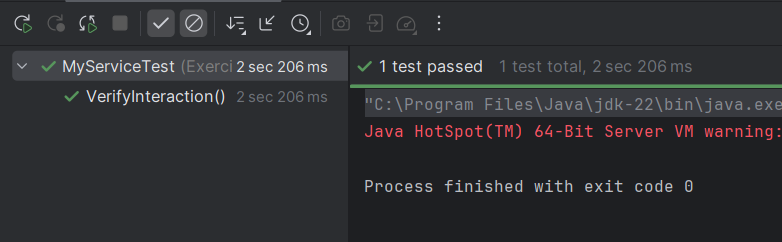

### Exercise 3: Argument Matching
- Goal: Match method arguments using matchers.
- 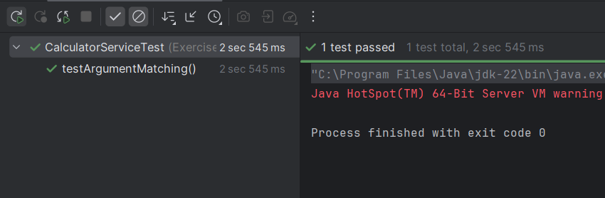

### Exercise 4: Handling Void Methods
- Goal: Stub and verify void methods.
- 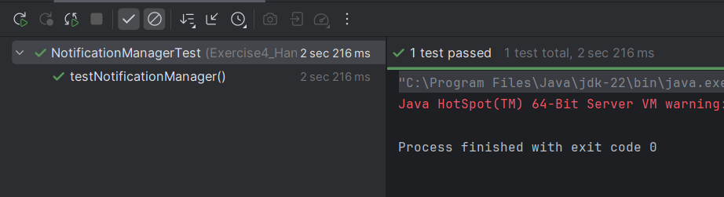

### Exercise 5: Multiple Return Values
- Goal: Stub methods to return different values consecutively.
- 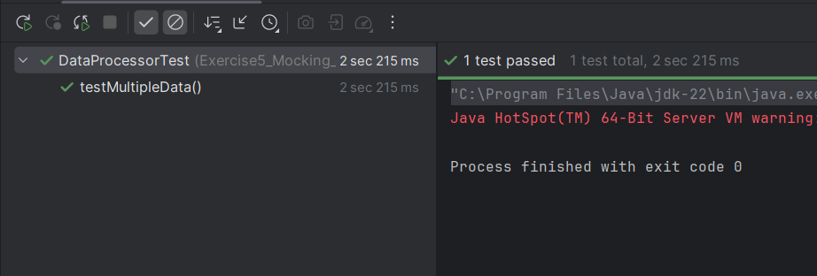

### Exercise 6: Verifying Interaction Order
- Goal: Verify the call order of methods.
- 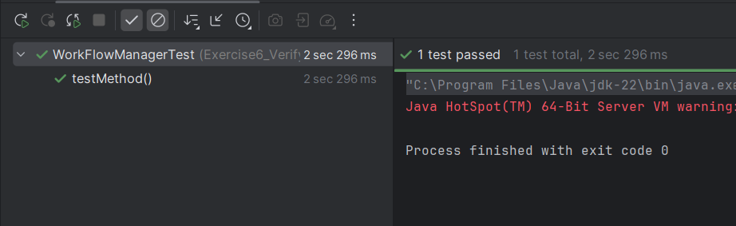

### Exercise 7: Void Methods with Exceptions
- Goal: Stub void methods to throw exceptions.
- 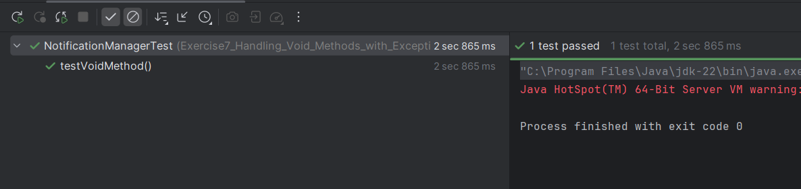

---

## 🪵 SLF4J Logging

### Exercise 1: Error and Warning Levels
- Goal: Log messages with ERROR and WARN levels using SLF4J.
- 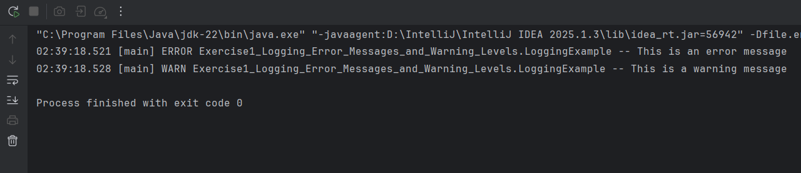

### Exercise 2: Parameterized Logging
- Goal: Use parameterized log messages to improve efficiency.
- 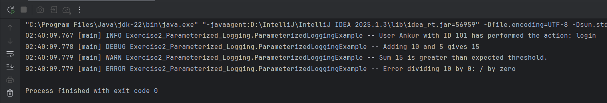

### Exercise 3: Different Appenders
- Goal: Configure and use console & file appenders in `logback.xml`.
- 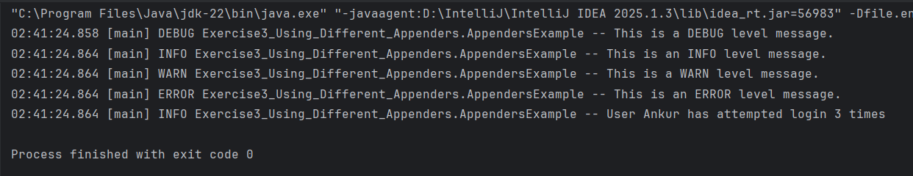

---