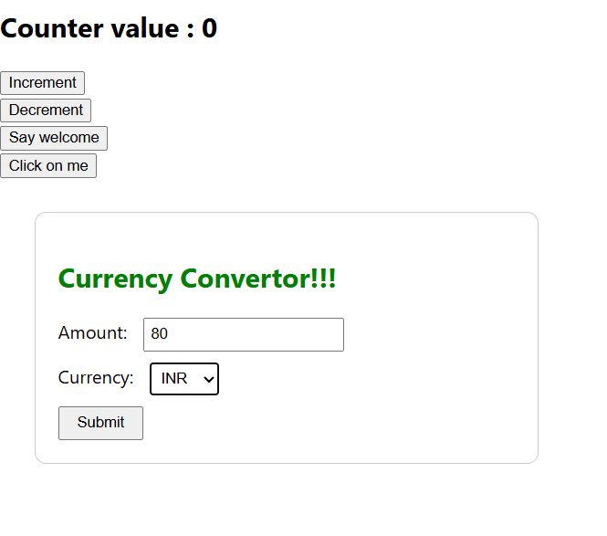

# 📘 React Events Hands-on Lab

This document introduces the event system in React, including the concept of synthetic events, event handlers, and React’s naming conventions for events. This will help developers handle user interactions like clicks, form submissions, and keyboard actions in a React-friendly way.

## 🧾 Table of Contents

- React Events Overview
- Event Handlers in React
- What is a Synthetic Event?
- React Event Naming Conventions
- Hands-on Lab Tasks

## 🔹 React Events Overview

In React, events are triggered just like in HTML (e.g., onClick, onChange), but are handled differently behind the scenes using a cross-browser wrapper called the SyntheticEvent.

```javascript
function handleClick() {
  alert("Button was clicked!");
}

<button onClick={handleClick}>Click Me</button>
```

React normalizes events to ensure consistent behavior across all browsers.

Events can be added to any JSX element.

## 🔹 Event Handlers in React

Event handlers in React are JavaScript functions that run when a specific user interaction occurs.

Example:

```javascript
function handleChange(event) {
  console.log("Input changed:", event.target.value);
}

<input type="text" onChange={handleChange} />
```

The function receives a single parameter: the event object.

It's common to use arrow functions or bind methods to preserve `this`.

## 🔹 What is a Synthetic Event?

React wraps browser events into a SyntheticEvent object to:

- Provide consistent cross-browser behavior
- Improve performance with event pooling
- Allow for a familiar API similar to native DOM events

```javascript
function handleSubmit(event) {
  event.preventDefault(); // Prevents form refresh
  console.log("Form submitted");
}
```

## 🔹 React Event Naming Conventions

| Native HTML | React JSX |
|-------------|------------|
| onclick     | onClick    |
| onchange    | onChange   |
| onkeydown   | onKeyDown  |

React uses camelCase for all event names.

The event handler is passed as a function reference, not as a string.

## 🧪 Hands-on Lab Tasks

- Create a button with an onClick event that displays an alert.
- Create a form input that logs the current value using onChange.
- Use `preventDefault()` inside an event handler to stop form submission.
- Explore event object properties like `target`, `type`, and `key`.

---
## Output


---

✨ This lab provides a clear understanding of how to handle events in React using synthetic events and event handlers.