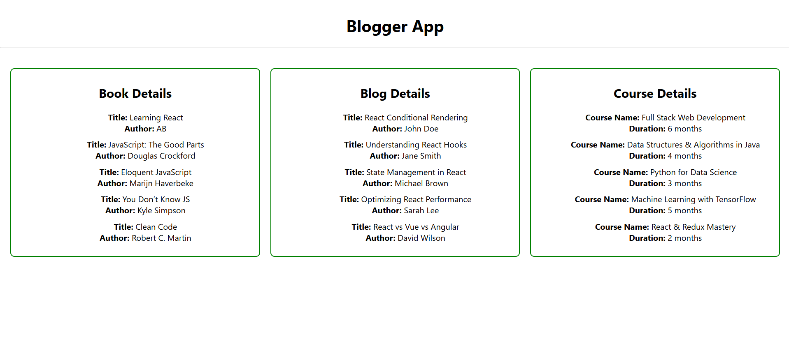

# 📘 React Lists, Keys, and Conditional Rendering

This document covers various techniques for conditional rendering, rendering multiple components, using list components, and understanding keys in React applications.

## 🧾 Table of Contents

- Various Ways of Conditional Rendering
- Rendering Multiple Components
- Defining a List Component
- Keys in React Applications
- Extracting Components with Keys
- React Map and `map()` Function

## 🔹 Various Ways of Conditional Rendering

React supports multiple ways to conditionally render elements:

### 1. **If-Else Statement**
```javascript
if (isLoggedIn) {
  return <Dashboard />;
} else {
  return <LoginForm />;
}
```

### 2. **Ternary Operator**
```javascript
{isLoggedIn ? <Dashboard /> : <LoginForm />}
```

### 3. **Logical AND (&&) Operator**
```javascript
{hasNotifications && <NotificationIcon />}
```

### 4. **Element Variables**
```javascript
let content = isOnline ? <OnlineStatus /> : <OfflineStatus />;
return <div>{content}</div>;
```

## 🔹 Rendering Multiple Components

You can render multiple components together inside a wrapper element or React fragment:

```javascript
function App() {
  return (
    <div>
      <Navbar />
      <Sidebar />
      <MainContent />
    </div>
  );
}
```

Or use fragments to avoid extra DOM nodes:

```javascript
<>
  <Navbar />
  <Footer />
</>
```

## 🔹 Defining a List Component

A list component renders a list of data items using the `map()` function.

### Example:
```javascript
function NumberList(props) {
  return (
    <ul>
      {props.numbers.map((number) => <li key={number}>{number}</li>)}
    </ul>
  );
}
```

## 🔹 Keys in React Applications

**Keys** help React identify which items have changed, been added, or removed. They must be unique among siblings.

### Why are keys important?
- Improve performance
- Maintain component state between renders

### Bad key (index-based):
```javascript
items.map((item, index) => <li key={index}>{item}</li>)
```

### Good key (unique ID or value):
```javascript
items.map((item) => <li key={item.id}>{item.name}</li>)
```

## 🔹 Extracting Components with Keys

When you extract list items into components, always pass the `key` prop to the component instance, not to the component itself.

### Example:
```javascript
function ListItem(props) {
  return <li>{props.value}</li>;
}

function NumberList(props) {
  const numbers = props.numbers;
  return (
    <ul>
      {numbers.map((number) =>
        <ListItem key={number.toString()} value={number} />
      )}
    </ul>
  );
}
```

## 🔹 React Map and `map()` Function

The `map()` function is used to transform arrays of data into arrays of JSX elements.

### Example:
```javascript
const names = ['Alice', 'Bob', 'Charlie'];
const listItems = names.map((name) => <li key={name}>{name}</li>);
```

Using `map()` makes it easy to dynamically render UI elements based on arrays of data.

---

## Output


---

✨ Mastering lists, keys, and conditional rendering in React allows for efficient, dynamic, and scalable UI development.
